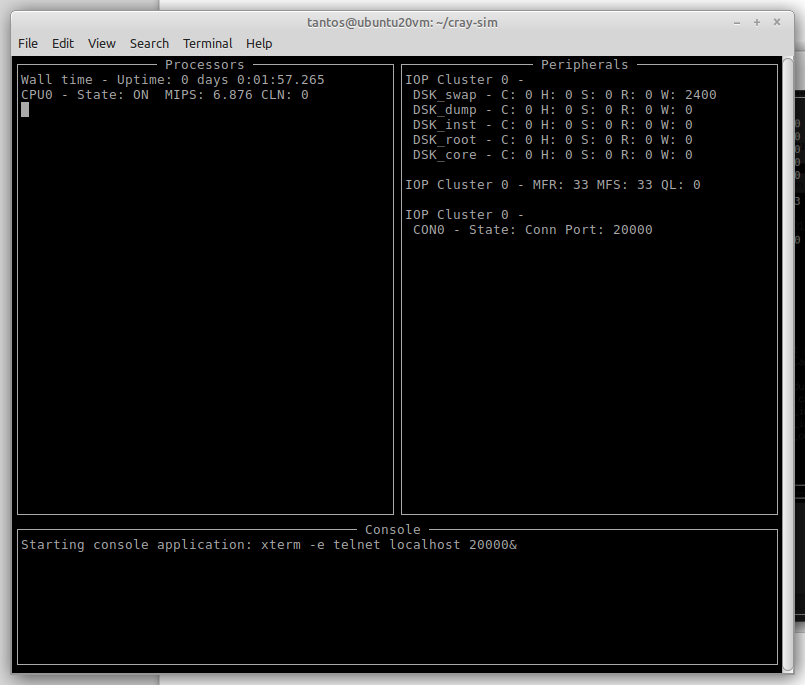
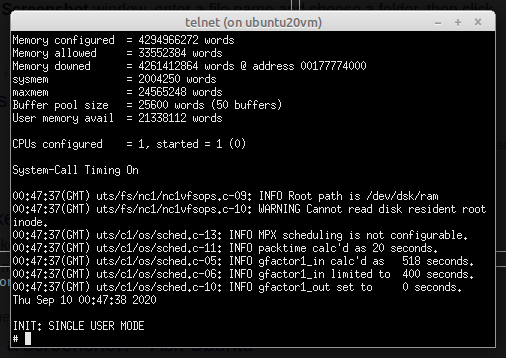

# How to install UNICOS on the Cray simulator

This document will describe the process to:

1. Configure your host machine to run the Cray PVP simulator
2. Download and build the Cray PVP simulator
3. Configure and run the Cray PVP simulator for UNICOS running from RAMFS
4. Steps to install UNICOS inside the Cray PVP simulator
5. Reconfigure the Cray PVP simulator to run the installed UNICOS system

*Word of caution*: UNICOS is a rather old, legacy system. The installation process will require you to install and use insecure utilities on the host machine. Only attempt these steps on a host machine, connected to a secure network. A VM is recommended.

The instructions bellow will assume a base Ubuntu 20.04 LTS server install. This operating system is bare-bones enough that hopefully almost none of the required utilities come preinstalled and consequently the instructions are complete for any other Debian flavor as well. For other OSes, such as Gentoo or RedHat based systems, similar steps are needed, but YMMV.

# Configure your host machine to run the Cray PVP simulator

## Install the prerequisites

	sudo apt install rsh-client rsh-server
	sudo apt install git
	sudo apt install g++ make libboost-all-dev libncurses-dev libgpm-dev
	sudo apt install xterm telnet

# Set up networking

Here we’re going to create a virtual Ethernet bridge. One port on it will connect to the host machine and another one to the simulator.

Create a file, named `/etc/netplan/50-cray-bridge.yaml` with the following content:

	network:
		ethernets:
			tap1:
				optional: true
		bridges:
			craybr:
				addresses:
					- 172.16.0.1/24
				optional: true
				interfaces:
					- tap1

Create a new tap device using `systemd`. Save the following content into `/etc/systemd/network/tap1.netdev`:

	[NetDev]
	Name=tap1
	Kind=tap

Apply the configuration:

	netplan apply

# Download and build the Cray PVP simulator

	git clone https://github.com/andrastantos/cray-sim.git
	cd cray-sim/simulator
	make build

# Configure and run the Cray PVP simulator for UNICOS running from RAMFS

First, you’ll need the ISO image for UNCOS 10. In this install I’m going to use UNICOS 10.0.1.2, but 10.0.0 and 10.0.0.2 are also supported at this point.

Mount the ISO image. I’m going to use `/mnt` as the mount point. I’m also assuming you’ve downloaded the built the simulator in your home directory, under the name `cray-sim`:

	export ISO=/mnt
	export SIM=~/cray-sim

Copy the RAM file-system and the compressed kernel image over to the simulator

	cp $ISO/unicos_exe/ram_fs $SIM
	cp $ISO/unicos_exe/krn_11.bgz $SIM

Extract the kernel image:

	cd $SIM
	gzip -d -- < krn_11.bgz | cpio -i

This command creates a bunch of files in `$SIM`, most importantly, `unicos.generic`, which is our kernel.

At this point, you’re ready to launch the RAMFS-based simulation:

	./unicos_ramfs

This should bring up the main simulator window:

.. and pretty quickly, the UNICOS console:

*Note:* in order to run xterm, which the UNICOS main console above uses, you’ll have to have a functional windowing environment of sorts. In my case, I’m SSH-ing into the VM and using X-forwarding to make this work, so the VM itself doesn’t have X installed. Again, YMMV.

# Steps to install UNICOS inside the Cray PVP simulator

Now, we are ready to bring up networking in UNICOS. In the UNICOS console (see above screenshot), type:

	ifconfig en0 172.16.0.2

This should succeed without errors. At this point, the host machine can be reached from UNICOS with the IP address `172.16.0.1`, while UNICOS has the IP address of `172.16.0.2`. The two machines should be able to ping each other.

We need to enable rlogin/rsh/rcp on the host because that’s the only protocol that the RAMFS system contains utilities for. So, edit `/etc/hosts.equiv` and add the following line:

	172.16.0.2 +

This allows any user from UNICOS to access the hosts file-system using rcp.

Copy over the install script to the simulator. In the simulator prompt, type:

	cd /
	rcp <<user>>@172.16.0.1:/<<path_to_sim>>/cray-sim/install /

replacing `<<user>>` with your user account on the host machine and `<<path_to_sim>>` with the path where you cloned the cray-sim repository.

To run the install script. On the simulator console, type:

	./install

This process will do the following things:

1. Asks you for your user name on the host machine and the install CD mount point – again – on the host.
2. Copy over the first few scripts from the install CD
3. Execute these scripts, which will create the root filesystem for the installation and mount it.
4. Copy over the compressed OS files
5. Extract the compressed OS files (this will take a *long* time)
6. Patch up the install to be a little more user-friendly and fix some issues.
7. Copy over the post-install script and execute it. It will – among other things – compile a new kernel for you, which is rather important as there is a bug in the original kernel that prevents it from booting into anything but single-user mode upon startup. (This will also take a *long* time)
8. It will ask you for a root password and create a new user for you (with your input).
9. UNICOS has the unhealthy habit of corrupting its filesystem due to its aggressive write-back cashing that I don’t know how to disable. As a work-around a cron-job is installed in the system that flushes this cache every second.

The installation process takes hours and hours so, plan accordingly and be patient. The process also spews a ton of output in the screen so it should at least provide some entertainment for you. You should not see the screen not changing for more than 2-3 minutes. In case you want to go back and look into what happened, the session is saved under the file `CON0` on the host machine, in the simulator directory.

# Reconfigure the Cray PVP simulator to run the installed UNICOS system

Now that the installation is complete, you can shut down the simulator by going to the main simulator window:

and typing `exit` in the bottom.

Once the simulator terminates, verify that the new kernel file `unicos.ymp.<<version number>>` exists in the simulator directory. The `<<version number>>` should match the UNICOS version you are installing. This is the kernel that just got compiled during the installation process and got copied back to the host.

Make sure that the simulator configuration file `unicos.cfg` references your new kernel. Open up the file in an editor an look for this section

	IopClusters {
		SimIopCluster {
			DontTouchExchangePacket no
			IopRevision          IOSE               ; Controls communication standard. Possible values are IOSD and IOSE
			MasterCluster        Yes
			KernelFileName       unicos.ymp.10012 ; <<<< EDIT THIS FOR THE KERNEL FILE YOU HAVE
			KernelPreamble       0x40
			ParameterFileName    unicos.param
			RamFsFileName        ram_fs
			RunLevel 2

Edit the parameter `KernelFileName` to match your kernel.

At this point, you are ready to start the simulator in full OS mode. There is a pre-created script that does that for you, so all that’s needed is to type:

	./unicos

This should bring up the same simulator window, but now boot UNICOS, using the newly created kernel and root filesystem. It should also boot into multi-user mode (init level 2) by default. The boot process `fscks` the root filesystem several times, it might even find some inconsistencies, but should run to completion without user interaction needed. When it’s all said and done, you should be greeted by a login prompt. Here you can log in either as root or the user you've created during the installation process.

Congratulations, you've finished installing UNICOS!

# Goodies

The system you've just installed is not the most user-friendly out of the box. It lacks many utilities you might have gotten used to and the configuration of it might not be what you like. There are a few utilities pre-compiled for UNICOS-10 that you might find useful, under the `unicos_tools` directory.

To install these, rcp them over to UNICOS (as root):

	rcp <<user>>@172.16.0.1:/<<path_to_sim>>/cray-sim/unicos_tools/goodies.tar /goodies.tar

Extract extract goodies.tar into /usr:

	cd /usr
	tar xvf /goodies.tar
	rm /goodies.tar

This should have put `bash` and `mc` (Midnight Commander) into `/usr/bin` and thus, in your path.

You can get `lynx`, a text-based web-browser and `wget` a similar way. *Note*: These utilities were compiled without SSL support, so they are limited to un-encrypted resources, of which there is less and less.

# System configuration

There is extensive documentation out there on UNICOS, and your installation also comes with a huge number of man pages. This document doesn't inspire to be an authoritative source on how to configure or use your new-fangled installation. Here are a few general tips and hints:

- As usual with UNIX systems, `/etc` is where you'll find the configuration files.
- As unusual with at least LINUX systems `/etc` is also home to a lot of binary utilities, so adding it to your `$PATH` is probably wise.
- The default versions of all these configuration files can be found under `/skl/etc` in case you need to compare to defaults.
- An interesting place to look for configuration files is `/etc/config`, where some of the most important system parameters are set
- The system defaults to not have a separate /tmp filesystem which might not what you want. If you want to enable that, change the following line: `TMPDEV=''` to `TMPDEV='tmp'` in `/etc/config/rcoptions`.
- Similarly, there's a `/usr/tmp` which you might want to point to a different filesystem. If you want to enable that, change the following line: `USRTMPDEV=''` to `USRTMPDEV='usr_tmp'` in `/etc/config/rcoptions`.
